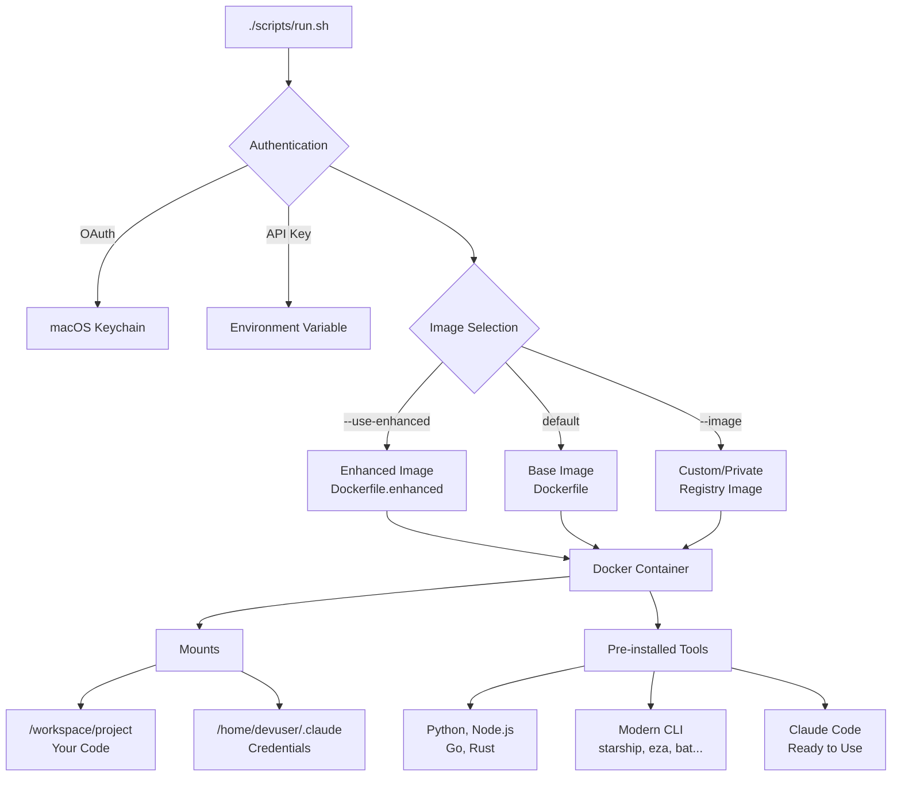

<p align="center">
  
</p>

<h1 align="center">Claude DevContainer</h1>

<table align="center">
<tr>
<td align="center">
<h2>&lt; 1 min</h2>
<sub>From clone to<br>coding</sub>
</td>
<td align="center">
<h2>5</h2>
<sub>Languages<br>pre-installed</sub>
</td>
<td align="center">
<h2>20+</h2>
<sub>Modern CLI<br>tools included</sub>
</td>
<td align="center">
<h2>0</h2>
<sub>Config files<br>to write</sub>
</td>
</tr>
</table>

<p align="center">
  <a href="https://hub.docker.com/r/grandcamel/claude-devcontainer"></a>
  
  
  
  
  <a href="https://github.com/grandcamel/claude-devcontainer"></a>
  
</p>

<p align="center">
  <strong>Batteries-included developer containers for Claude Code.</strong><br>
  <sub>Python, Node.js, Go, Rust, modern CLI tools—ready in seconds, not hours.</sub>
</p>

<div align="center">

```
┌───────────────────────────────────────────────────────────────┐
│ $ ./scripts/run.sh --use-enhanced                             │
├───────────────────────────────────────────────────────────────┤
│ [INFO] Starting developer container...                        │
│                                                               │
│ ✓ Python 3.11, Node.js 20, Go 1.22, Rust ready                │
│ ✓ Claude Code authenticated via OAuth                         │
│ ✓ Modern CLI: starship, eza, bat, lazygit, neovim             │
│ ✓ Your project mounted at /workspace/project                  │
│                                                               │
│ dev:/workspace/project$                                       │
│ Ready to code. No setup required.                             │
└───────────────────────────────────────────────────────────────┘
```

</div>

<p align="center">
  <a href="#quick-start"><strong>Get Started</strong></a> •
  <a href="#included-toolchains">Toolchains</a> •
  <a href="#who-is-this-for">Use Cases</a> •
  <a href="#team-customization">Teams</a> •
  <a href="#architecture">Architecture</a>
</p>

---

## The Difference

<table>
<tr>
<td width="50%">

### ❌ The Old Way
```bash
# Write a Dockerfile (30 min)
# Debug PATH issues (20 min)
# Install Python, Node, Go... (15 min)
# Configure Claude Code auth (10 min)
# "Works on my machine" (∞ hours)
# New teammate joins → repeat
```
*Hope everyone has the same setup...*

</td>
<td width="50%">

### ✅ The New Way
```bash
./scripts/run.sh --use-enhanced
```
*Identical environment. Every time. Everyone.*

</td>
</tr>
</table>

### Time Saved

| Task | Manual Setup | With DevContainer | Saved |
|------|--------------|-------------------|-------|
| New dev environment | 2-4 hours | 1 minute | 97% |
| Onboard new teammate | 1-2 hours | 30 seconds | 99% |
| Add Python + Node + Go + Rust | 45 minutes | 0 (pre-installed) | 100% |
| Configure Claude Code in container | 30 minutes | 0 (just works) | 100% |
| Debug "works on my machine" | Hours/days | 0 (identical env) | 100% |

**Solo developer:** Save a full day on environment setup.
**Team of 8:** Reclaim 2+ weeks per year on onboarding alone.

---

## Quick Start

### 1. Clone & Run

```bash
git clone https://github.com/grandcamel/claude-devcontainer.git
cd claude-devcontainer
./scripts/run.sh
```

### 2. Use Enhanced Image (Recommended)

```bash
# Pre-built with modern CLI tools (instant startup)
./scripts/run.sh --use-enhanced
```

### 3. Mount Your Project

```bash
./scripts/run.sh --use-enhanced --project ~/myproject
```

**That's it.** You're now in a fully-loaded dev environment with Claude Code ready to go.

<p align="center">
  <a href="#configuration-options"><strong>All Options →</strong></a>
</p>

---

## Docker Hub Images

Pre-built images available on Docker Hub:

```bash
# Base image (languages + tools)
docker pull grandcamel/claude-devcontainer:latest

# Enhanced image (+ starship, eza, bat, lazygit, neovim)
docker pull grandcamel/claude-devcontainer:enhanced
```

Or run directly:
```bash
docker run -it -v $(pwd):/workspace/project grandcamel/claude-devcontainer:enhanced
```

---

## Who Is This For?

<details>
<summary><strong>👨‍💻 Individual Developers</strong> — Zero-config development</summary>

**Stop wasting time on environment setup.**

You want to code, not write Dockerfiles. You need Python for scripts, Node for frontend, Go for CLIs, and Rust for performance-critical code. You want Claude Code to just work.

```bash
# Clone, run, code
./scripts/run.sh --use-enhanced --project ~/my-polyglot-project
```

### What You Get

| Need | Solution |
|------|----------|
| Multiple languages | Python 3.11, Node.js 20, Go 1.22, Rust—all ready |
| Modern tooling | Starship prompt, eza, bat, lazygit, neovim |
| Claude Code | Pre-installed with OAuth auth (or API key) |
| Your project | Mounted and ready at `/workspace/project` |
| Extra packages | `--pip flask --npm typescript` at runtime |

**Time saved:** 2-4 hours on initial setup, every single time.

</details>

<details>
<summary><strong>👥 Teams</strong> — Consistent environments for everyone</summary>

**Eliminate "works on my machine" forever.**

New developer joins on Monday. By Tuesday they're productive—not still debugging PATH issues.

### Team Workflow

```bash
# Add to your project as a submodule
git submodule add https://github.com/grandcamel/claude-devcontainer.git .devcontainer

# Everyone runs the same command
./.devcontainer/scripts/run.sh --project . --use-enhanced
```

### Team Benefits

| Challenge | Solution |
|-----------|----------|
| Inconsistent environments | Identical container for everyone |
| Slow onboarding | 30 seconds to full dev environment |
| Dependency conflicts | Isolated per-project containers |
| "It worked yesterday" | Versioned, reproducible images |

### Customize for Your Team

```yaml
# team-config.yaml
image:
  base: grandcamel/claude-devcontainer:enhanced
  name: my-company/dev-container

pip:
  - flask
  - sqlalchemy

npm:
  - typescript

environment:
  TEAM_NAME: "Platform Engineering"
```

```bash
./scripts/build-team-image.sh --config team-config.yaml --build
```

**Time saved:** 1-2 hours per new hire × 10 hires/year = 2+ weeks reclaimed.

</details>

<details>
<summary><strong>🏢 Enterprise</strong> — Private registries & corporate certificates</summary>

**Full control for security-conscious organizations.**

Corporate proxy? Private registry? Custom CA certificates? All supported.

### Private Registry Workflow

```bash
# Build with corporate CA certificate (e.g., Zscaler)
./scripts/build-enhanced.sh --ca-cert zscaler.crt

# Publish to your registry
./scripts/publish-to-registry.sh \
  --config team-config.yaml \
  --registry harbor.company.com \
  --user deployer \
  --token $REGISTRY_TOKEN
```

### Enterprise Features

| Requirement | Solution |
|-------------|----------|
| Corporate proxy/CA | `--ca-cert zscaler.crt` during build |
| Private registry | Push to Harbor, Nexus, GitLab Registry |
| Versioned releases | Git tag → image tag mapping |
| Air-gapped environments | Pre-built images, no runtime downloads |
| Audit trail | Generated Dockerfile in version control |

### Team Members Pull & Run

```bash
# Pull from private registry
docker pull harbor.company.com/platform/dev-container:1.0.0

# Or use run.sh
./scripts/run.sh --image harbor.company.com/platform/dev-container --tag 1.0.0
```

**Time saved:** Days of security review per custom Dockerfile avoided.

</details>

---

## Included Toolchains

### Languages

| Language | Version | Package Managers |
|----------|---------|-----------------|
| Python | 3.11 | pip, venv, poetry, uv |
| Node.js | 20 | npm, yarn, pnpm |
| Go | 1.22 | go modules |
| Rust | stable | cargo |

### Cloud & DevOps

- AWS CLI v2
- GitHub CLI (gh)
- Docker CLI (mount socket for Docker-in-Docker)

### Database Clients

- PostgreSQL (psql)
- MySQL
- Redis (redis-cli)
- SQLite

### Development Tools

- git, git-lfs
- jq, yq
- ripgrep, fd, fzf
- httpie, curl, wget
- shellcheck
- make, cmake, gcc

### Pre-installed Packages

**Python:** pytest, black, ruff, mypy, httpx, rich, typer, ipython, jupyter, pandas, numpy

**Node.js:** TypeScript, ts-node, ESLint, Prettier

---

## Enhanced Tools

The enhanced image (`--use-enhanced`) includes modern CLI replacements:

| Tool | Replaces | Description |
|------|----------|-------------|
| Starship | PS1 | Fast, customizable prompt |
| eza | ls | ls with icons and git status |
| bat | cat | Syntax highlighting |
| delta | diff | Better git diffs |
| zoxide | cd | Smart directory jumping |
| btop | top | Modern system monitor |
| lazygit | — | Git terminal UI |
| tmux | — | Terminal multiplexer (Ctrl-a prefix) |
| neovim | vim | Modern editor + kickstart config |
| direnv | — | Per-directory environments |

---

## Configuration Options

```
Usage: ./scripts/run.sh [options] [-- command...]

Options:
  --project, -p PATH    Mount project directory (default: current directory)
  --docker              Mount Docker socket for Docker-in-Docker
  --persist-cache       Persist Go, Cargo, npm caches across sessions
  --port, -P PORT       Expose port (can be used multiple times)
  --env, -e VAR=VAL     Set environment variable
  --volume, -v SRC:DST  Mount additional volume
  --name NAME           Container name (for reattaching)
  --detach, -d          Run in background
  --build               Rebuild Docker image before running
  --model NAME          Claude model (sonnet, haiku, opus)
  --claude-version VER  Use specific Claude Code version

Custom Image:
  --image NAME          Custom image name
  --tag TAG             Custom image tag (default: latest)
  --push                Push image to registry after building
  --use-enhanced        Use pre-built enhanced image (instant startup)

Additional Packages:
  --pip PKG[,PKG,...]   Install Python packages at startup
  --npm PKG[,PKG,...]   Install npm packages globally at startup
  --apt PKG[,PKG,...]   Install system packages via apt at startup

Authentication:
  (default)             Use OAuth from macOS Keychain
  --api-key             Use ANTHROPIC_API_KEY environment variable
  --api-key-from-config Use primaryApiKey from ~/.claude.json
```

### Examples

```bash
# Full development setup with Docker and ports
./scripts/run.sh --project ~/app --docker --port 3000:3000 --port 8080:8080

# Persistent caches for faster subsequent runs
./scripts/run.sh --persist-cache --project ~/myproject

# Install additional packages at runtime
./scripts/run.sh --pip flask,sqlalchemy --npm lodash --apt graphviz

# Named container (reattach with: docker exec -it mydev bash)
./scripts/run.sh --name mydev --detach

# Specific Claude Code version
./scripts/run.sh --claude-version 2.0.69
```

---

## Team Customization

Create a team-specific container with your packages and certificates:

```yaml
# team-config.yaml
image:
  base: grandcamel/claude-devcontainer:enhanced
  name: my-company/dev-container
  tag: latest

certificate:
  file: zscaler.crt

pip:
  - flask
  - sqlalchemy
  - boto3

npm:
  - typescript
  - "@types/node"

apt:
  - graphviz
  - libpq-dev

environment:
  TEAM_NAME: "Platform Engineering"

labels:
  maintainer: "platform-team@company.com"
```

```bash
# Generate Dockerfile.team (for version control)
./scripts/build-team-image.sh --config team-config.yaml

# Build and push
./scripts/build-team-image.sh --config team-config.yaml --build --push
```

---

## Architecture



### Project Structure

```
claude-devcontainer/
├── Dockerfile              # Base image
├── Dockerfile.enhanced     # Pre-built enhanced image
├── lib/
│   └── container.sh        # Shared shell functions
├── scripts/
│   ├── run.sh              # Main runner
│   ├── build-enhanced.sh   # Enhanced image builder
│   ├── build-team-image.sh # Team customization
│   └── publish-to-registry.sh
├── config/
│   ├── starship.toml       # Prompt configuration
│   ├── tmux.conf           # Tmux configuration
│   └── setup-enhanced.sh   # Runtime enhancement
└── examples/
    └── team-config.yaml    # Team config template
```

---

## Installation Options

### Option 1: Clone Repository

```bash
git clone https://github.com/grandcamel/claude-devcontainer.git
cd claude-devcontainer
./scripts/run.sh
```

### Option 2: Git Submodule

```bash
git submodule add https://github.com/grandcamel/claude-devcontainer.git .devcontainer
./.devcontainer/scripts/run.sh --project .
```

### Option 3: Direct Docker

```bash
docker run -it -v $(pwd):/workspace/project grandcamel/claude-devcontainer:enhanced
```

---

## Environment Variables

| Variable | Description |
|----------|-------------|
| `ANTHROPIC_API_KEY` | API key for Claude (with --api-key flag) |
| `CLAUDE_CODE_DISABLE_NONESSENTIAL_TRAFFIC` | Set to 1 in container |
| `CLAUDE_PLUGIN_DIR` | Plugin directory mount point |

---

## Contributing

Contributions are welcome! Please see [CONTRIBUTING.md](CONTRIBUTING.md) for guidelines.

---

## License

MIT License — see [LICENSE](LICENSE) for details.

---

<p align="center">
  <strong>Stop configuring. Start coding.</strong>
  <br>
  <sub>Built for Claude Code by developers who were tired of writing Dockerfiles.</sub>
</p>
